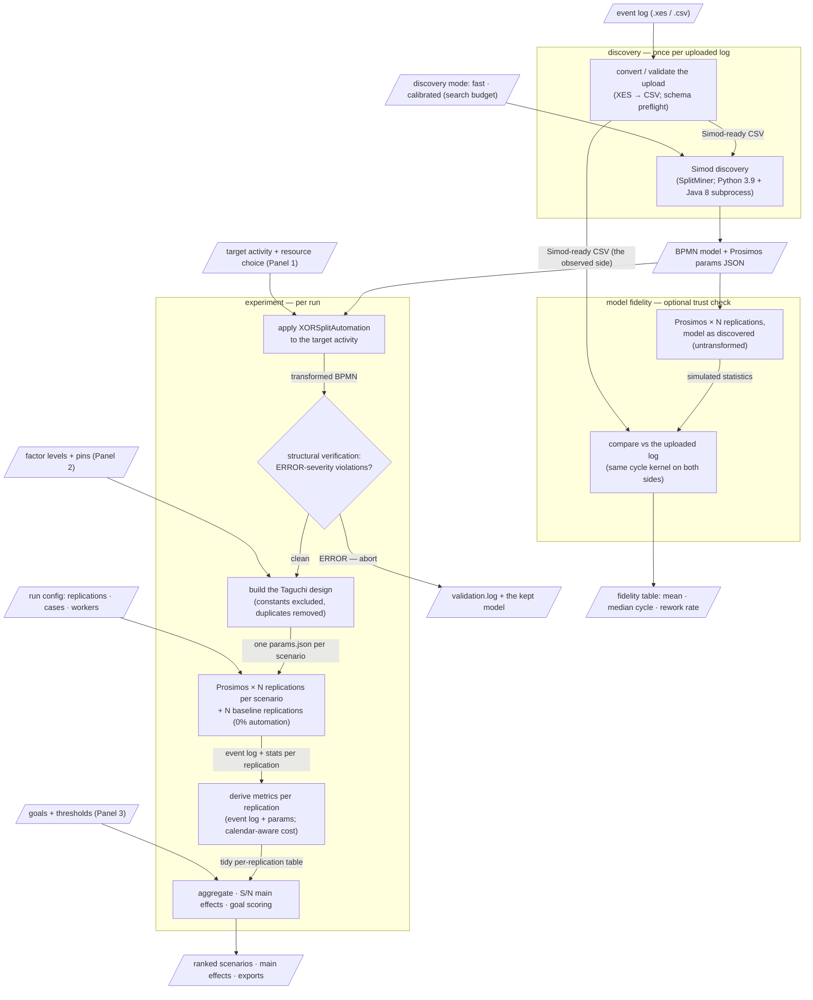

# Architecture

This document explains how **Goal-oriented Process Automation via Simulation**
is built and how its method works — the simulation design, the discovered-model
mechanics, and the limits of both. It is one of three documentation axes:

- **[README.md](../README.md)** — practical: installing, running, and the main
  user flow.
- **This document** — the architecture and the method: what each part does,
  what the method can and cannot conclude, and the constraints the external
  tools impose.
- **[CLAUDE.md](../CLAUDE.md)** — rationale: why things are shaped this way,
  design decisions with their rejected alternatives, and orientation for
  AI-assisted work on the codebase.

Metric semantics (each KPI's clock, inclusions, and trust tier) have their own
reference: [docs/metrics.md](metrics.md).

## The pipeline

Node shapes follow one convention throughout: parallelograms are data
(uploads, artifacts on disk, UI inputs), rectangles are processing stages,
diamonds are decisions; edge labels name what actually flows.



**Discovery.** Simod mines the uploaded log into a BPMN model plus a Prosimos
simulation-parameters JSON (durations per task, resource pools and calendars,
gateway probabilities, arrival distribution). XES uploads are first converted
to Simod's CSV schema in-process; direct CSV uploads are validated against
that schema *before* the multi-minute Simod spawn, so a malformed file fails
in milliseconds with a message naming the problem.

**Transformation.** The user picks a target activity; `XORSplitAutomation`
rewires the model so a configurable share of cases takes an automated version
of that activity (see [The pattern](#the-pattern)). A structural verifier then
checks the transformed model is wired exactly as the pattern intends — at the
executable `sourceRef`/`targetRef` level, not the diagram level — and a failed
check aborts the experiment with the verdict kept on disk beside the model.

**Design.** The pattern's factors and the user's level edits become a Taguchi
orthogonal-array design: one scenario per array row (see
[The method](#the-method-taguchi-design-of-experiments)).

**Simulation.** Every scenario runs N replications in Prosimos, in parallel,
alongside N replications of the **baseline** — the *transformed* model at 0%
automation, so baseline-vs-scenario deltas isolate the automation itself
rather than a distribution-shape change.

**Analysis.** Every product metric is derived first-principles from each
replication's event log plus the parameters JSON (never from Prosimos's own
statistics file — that file is used only to audit our numbers; see
[The trust stack](#the-trust-stack)). Scenarios are ranked by piecewise-linear
goal satisfaction, and Taguchi signal-to-noise main effects show which factors
matter.

**Model fidelity (side flow).** Independently of any experiment, the
discovered model can be simulated *untransformed* and compared against the
uploaded log — a trust check on discovery itself. This is deliberately **not**
the baseline; the two must never be conflated (the baseline is transformed,
the as-discovered run is not).

## The method: Taguchi design of experiments

The design is a Taguchi orthogonal array: L18 samples 18 of the 729 possible
six-factor configurations such that every pair of factors sees all nine level
combinations equally often. Factor **main effects** are measurable at 18
runs; factor **interactions** are not — "automation share matters most" is a
supported conclusion, "automation share only helps when the bot pool is
large" is not measurable in this design.

- `pick_array` chooses the array by varying-factor count: ≤4 factors → L9
  (9 rows), 5–7 → L18 (18 rows), 0 → a single degenerate row.
- **Design constants.** A factor pinned to a single value (via the Panel 2
  Pin checkbox, or by editing its three levels equal) is excluded from the
  array and injected into every scenario as a fixed value — so pinning two or
  more factors drops an 18-scenario design to 9. Structurally frozen factors
  (see [the shared-resource lock](#the-pattern)) behave the same way, except
  the value is discovered rather than chosen.
- **Duplicate removal.** After constants are excluded, rows that resolve to
  identical configurations are dropped (first occurrence wins; scenario ids
  keep their array-row numbers, so gaps in S01…S18 mark removed rows).
  Duplicates only arise under heavy pinning — four or more constant factors —
  because any two L18 rows differ in at least four of the six columns; the
  scenario-count savings come from the array shrink, not the deduplication.
- **Dummy levels.** Setting two of a factor's three levels equal keeps the
  factor in the design as a two-value factor with a deliberate 2:1 exposure
  weighting (a standard Taguchi technique). It is a weighting instrument, not
  a cost saver — it essentially never removes scenarios.
- **Replications and noise.** Each scenario runs N stochastic replications;
  analysis aggregates per-scenario means and computes signal-to-noise ratios
  per factor level. A pinned factor has a single level, so its main effect is
  undefined and it ranks last automatically.
- **Goal scoring.** Each selected indicator scores 0–100 on a piecewise-linear
  scale (target = 100, measured baseline = 50, worst = 0, user-editable
  breakpoints); a metric's score is the weight-normalised mean of its
  indicators; the overall score is the **minimum** across metric goals — a
  scenario is only as good as its worst-performing goal. There are no
  cross-goal weights.

The intended iteration loop: run the full design → read the main-effects
charts → pin the factors that don't matter (at whatever value the charts
suggest) → re-run a smaller, cheaper design around the factors that do.

## The pattern

`XORSplitAutomation` is the only substitution pattern, by design — it is
central to the client's thesis, and no second pattern will be added. For a
target activity *Act* it produces:

```
  ─►(XOR1)──%Auto──►[Auto Act]──►(XOR2)──%OK──────────────────►(XOR4)─►
        │                              │
      100-Auto                      100-OK
        │                              │
        └──────────►(XOR3)◄────────────┘
                      │
                      ▼
                    [Act] (the original, non-automated path) ──►(XOR4)
```

| Factor | Default levels | Meaning |
|---|---|---|
| `pct_auto` (%) | 25 / 50 / 75 | Share of cases routed to the automated task |
| `pct_ok` (%) | 80 / 90 / 95 | Bot success probability (failures fall back to the human task) |
| `t_auto` (s) | 5 / 10 / 20 % of the discovered mean | Automated task duration |
| `t_manual` (s) | 80 / 100 / 120 % of the discovered mean | Human task duration (prepopulated from Simod) |
| `num_bots` | 1 / 2 / 3 | Bot pool size (a new pool) |
| `num_manual_resources` | discovered pool n − 1 / n / n + 1 | Human pool size, centred on the discovered staffing |

Method-level specifics a maintainer needs to know:

- **The shared-resource lock.** A target activity's resources may be assigned
  to other tasks too. Resizing a shared pool would change *those* tasks'
  behavior as a side effect, so shared resources are shown but locked in the
  resource selector; if every resource on the task is shared, the
  `num_manual_resources` factor is frozen at its discovered value and leaves
  the design entirely.
- **Single-entry/single-exit only.** The pattern requires the target task to
  have exactly one incoming and one outgoing flow. Discovered models always
  satisfy this (SplitMiner emits explicit gateways), so the guard is a loud
  backstop against hand-authored input, not a practical restriction.
- **Gateway probabilities are total.** Prosimos rejects a parameters file in
  which any gateway lacks an explicit probability entry — including
  single-path merges, which carry `value: 1.0`. The pattern therefore writes
  entries for all four gateways it adds.
- **Bot cost is run configuration**, not a factor: one $/hr scalar applied
  uniformly, like replication count and cases per replication. Cases per
  replication is likewise deliberately *not* a factor — it is simulation
  scale, not process design.

## Method limitations and tool constraints

- **Discovery has a structural ceiling.** Discovered models are parametric —
  smooth duration distributions, memoryless gateway probabilities — so
  history-dependent behavior (loops above all) is only approximated, and
  empirical extremes (min/max cycle) are not reproducible even by a
  well-fitted model. More data does not fix either; they are model-family
  limits, not estimation error. Fast mode is
  [Simod's one-shot discovery](https://github.com/AutomatedProcessImprovement/Simod)
  — "run Simod with default settings only once without the optimization
  phase," per Simod's own CLI — and can be tens of percent off on real-shaped
  logs; **calibrated discovery** (the sidebar's search mode) runs the
  optimization phase one-shot skips, measurably narrows the gap, and plateaus
  around 10 search iterations. Do not
  expect near-zero fidelity deltas on realistic logs — measure in the
  Model-fidelity tab and judge against tolerance bands. (Measured figures:
  the CLAUDE.md §8 calibrated-discovery bullet.)
- **Discovery cost scales with log size** — minutes for fast mode, 10–15 on
  a 100k-event log, several times that calibrated. Simod buffers its
  output until exit, so a silent log file mid-discovery is normal, not a
  hang.
- **The environment is pinned by Simod**: Python 3.9 + Java 8, isolated in
  virtualenvs under `tools/`, with everything crossing that boundary as a
  subprocess — the app's own runtime never mixes with the tool venvs. Setup:
  README.
- **Logs cannot answer everything.** Case arrival is absent from
  industry-normal logs, so door-to-door lead time is deliberately unmeasured;
  every cycle number uses one clock, first task start → last task end. Clock
  semantics, the XES start-synthesis caveat, and cost accounting (Prosimos
  charges calendar working time, not wall-clock spans) are specified in
  [docs/metrics.md](metrics.md).

## Anatomy of a run directory

Every unit of work gets its own timestamped folder under `runs/` — discovery,
each experiment run, and each fidelity run are separate directories, three
species of the same layout. An experiment run looks like:

```
runs/<exp-id>/
├── validation.log           # only when the structural gate found violations
├── baseline/
│   ├── params.json          # 0%-automation parameters, one per experiment
│   └── rep_NNN_log.csv / rep_NNN_stats.csv / rep_NNN_prosimos.log
└── scenarios/<sid>/
    ├── params.json          # the scenario's Prosimos input
    └── rep_NNN_log.csv / rep_NNN_stats.csv / rep_NNN_prosimos.log
```

A *discovery* directory holds the uploaded log as received, the Simod-ready
CSV, `simod.log` (subprocess output), the discovered model and parameters,
and — for calibrated discovery — `simod_config.yaml`, the exact recipe used.
A *fidelity* directory holds copies of the discovered model and parameters
plus an `as_discovered/` folder with the same per-replication triple.

The design intent: every run directory is a complete, reproducible artifact.
Models and parameters are copied in rather than referenced, subprocess logs
sit beside their outputs, and the maintainer trust checker can audit any
replication offline from the directory alone.

## The trust stack

Three verification layers, each with a deliberately different relationship to
the code it checks:

| Layer | What it checks | Oracle stance |
|---|---|---|
| Structural verifier (`core/bpmn/validate.py`) — gates every experiment | The transformed BPMN is wired exactly as the pattern intends, at the executable level | **Independent re-encoding**: imports neither the transform nor the shared query helpers, so a transform bug cannot silently update the oracle in lockstep |
| Trust checker (`core/simulation/validate.py`) — maintainer CLI | Our log-derived metrics reconcile against Prosimos's own statistics (cost and working seconds to the cent, case counts exactly) | **Imports the product engine**: the oracle here is a foreign tool's accounting, so re-deriving our metrics would verify a sibling, not the product |
| Model fidelity check — in-app tab | The discovered model vs reality: as-discovered replications against the same statistics computed from the uploaded log | **Shared kernel**: both sides run through one per-case cycle computation, so a computation drift cannot masquerade as model infidelity |

Supporting details: the fidelity run pins cases-per-replication to the log's
case count (sampling noise scales with case count, so the per-replication
spread is only a valid noise yardstick at equal n), and the per-replication
spread is displayed because the log is a single realization — it is the
yardstick for whether a delta is systematic misfit or run-to-run noise.

## The two flows and the runtime model

Past discovery, the page splits into two top-level tabs sharing one sidebar:
**Experiment** (the numbered panels: activity & pattern → factor levels →
goals → execution → results) and **Model fidelity** (the as-discovered run
and comparison). They are distinct flows — the fidelity check ignores the
target activity, factors, and goals entirely.

**Demo mode** uses a real, pre-baked Simod discovery (so the activity list,
discovered durations, and resource selector behave exactly like the real
pipeline) and fakes *only* the simulation with synthetic formulas. Demo
results are labeled illustrative, and demo CSV exports carry a `_demo`
filename suffix.

The Streamlit runtime rules, stated here because breaking them causes the
worst class of bug (see CLAUDE.md §6 for the full history):

- Streamlit reruns the whole script on every widget interaction, and a rerun
  can interrupt the running script mid-flight. Therefore **every blocking
  operation runs in a background thread** — experiments and fidelity runs via
  `ui/services/run_manager`, discovery via `ui/services/discovery_manager` —
  and the UI polls them with fragment-scoped timers.
- Background threads never touch `st.*` or session state; they communicate
  through pre-allocated state objects, and results are committed by the
  polling fragment on the main thread.
- Only modules under `ui/interactive/` may import streamlit. That single rule
  keeps everything else unit-testable.

## Failure modes

- **Bad uploads fail fast.** CSV schema problems are rejected before Simod
  launches, with a message naming the missing columns (including a hint when
  the issue is header capitalization). Malformed XES fails in the converter
  with a specific error.
- **Discovery failures surface with evidence.** A failed discovery shows the
  Simod log tail in an expander; a cancelled discovery kills the entire
  subprocess tree (Simod spawns Java and Prosimos children) and shows a
  cancelled state, never a spurious failure. A failed or cancelled
  *replacement* discovery leaves the previously committed model fully usable.
- **Runs degrade gracefully.** Each replication retries twice before being
  recorded as permanently failed; the experiment continues and returns
  partial results with the failure count displayed. Only an all-replications
  failure aborts the run. If every *baseline* replication fails, goal scoring
  is disabled (with an explanation) while scenario KPIs remain valid.
- **The validation gate fails loud.** A mis-wired transform aborts before any
  simulation, writing `validation.log` beside the kept model for inspection.

## Where things live in the code

| Package | Responsibility |
|---|---|
| `core/bpmn/` | BPMN XML: `query` reads, `edit` mutates, `validate` verifies |
| `core/simulation/` | Subprocess wrappers (`runner`), parallel executor, run-directory store, trust checker |
| `core/simulation/prosimos/` | Prosimos JSON: `query` reads, `editor` mutates, `calendars` joins params against logs; `replication_metrics` derives the numbers |
| `core/` (top level) | Domain: `transformations` (the pattern), `taguchi` (the design), `metrics`/`goals` (definitions + scoring), `analysis` (aggregation, S/N, ranking), `orchestrator` (run loops), `demo` |
| `ui/` (top level) | Pure display-prep primitives: `table`, `plots`, `param_inputs` |
| `ui/services/` | Streamlit-free services: background-run lifecycles, environment detection |
| `ui/interactive/` | The only streamlit importers: panels, pollers, selectors |
| `app.py` | Composition root: sidebar, routing, session state |

Dependencies flow strictly downward: `app.py → ui/interactive/ →
ui/services/ + ui/ primitives → core/`. `core/` never imports streamlit.
Metric *definitions* live in `core/metrics.py`; the *numbers* are computed in
`core/simulation/prosimos/replication_metrics.py` per replication and
aggregated in `core/analysis.py` — the `COL_*` constants in
`core/constants.py` tie the two together.

Deferred and rejected work is deliberately *not* listed here — CLAUDE.md §8
is the design record, and each deferred item lives there beside its
rationale.
